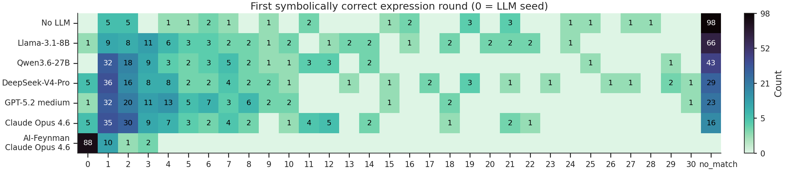
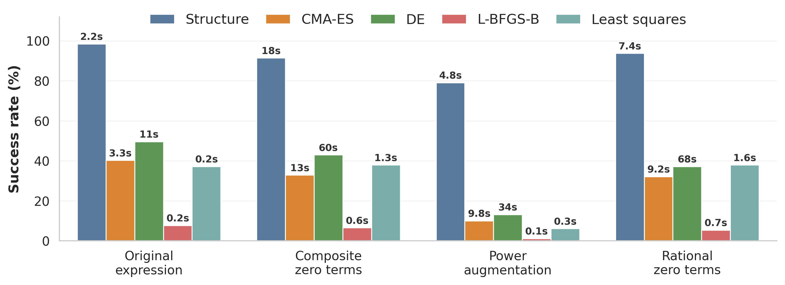
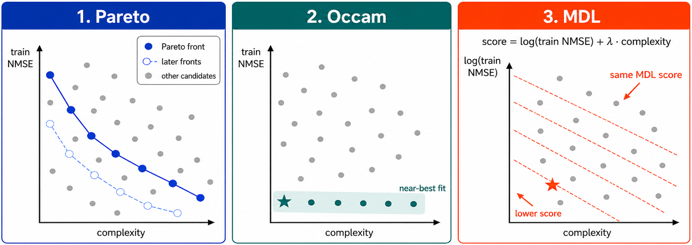
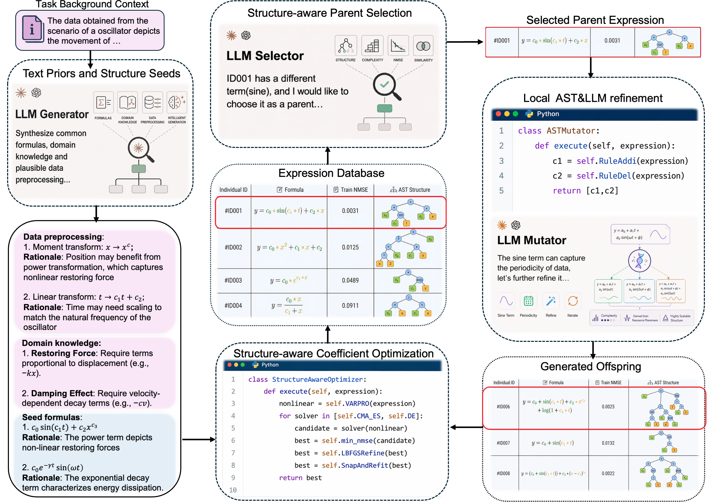
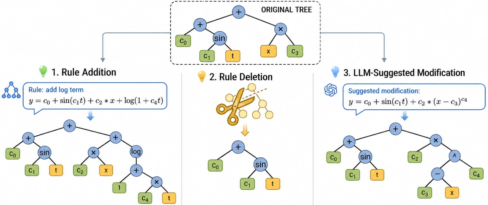

# FunctionEvolve: Structure-Guided Symbolic Regression with LLMs

FunctionEvolve is a neuro-symbolic evolutionary framework for **scientific equation
discovery**. It combines LLM reasoning with an explicit abstract-syntax-tree (AST)
search: domain-informed seeds and parent selection, local tree-edit mutation
(deterministic rules + LLM-guided proposals), and a structure-aware coefficient
optimizer that fits, simplifies, and scores each candidate.

This repository accompanies the paper
*FunctionEvolve: Structure-Guided Symbolic Regression with LLMs*
([arXiv:2606.07704](https://arxiv.org/abs/2606.07704)). It contains the
implementation, run launchers, baselines, the raw per-run logs behind every
reported number, and the curated result tables.

> Note: this is a curated snapshot for reviewers and readers. Large process
> artifacts (per-run token CSVs, re-evaluation transcripts, hyper-parameter sweeps)
> are omitted; the raw per-task transcripts, final result tables, figures, and the
> code needed to reproduce the headline metrics are kept.

---

## Key Results & Findings

**LLM-SRBench (129-task synthetic subset).** With *Claude Opus 4.6*, FunctionEvolve
recovers **107/129 exact symbolic forms** (82.9% SA@50) and **72/129 at top-1**
(55.8% SA@1) — a **4.5×** improvement over the strongest same-backbone reruns
(LLM-SR and OpenEvolve, 24 SA@50 each) and **3.6×** over the strongest previously
published top-1 result (PiT-PO, 20). Numerical precision stays near ground truth
(median test NMSE 1.38×10⁻¹³; Acc₀.₁ on 113/129 tasks).

| Method | Backend | SA@50 (SA@1) | Acc₀.₁ | Median test NMSE |
|---|---|---:|---:|---:|
| Direct Prompting | GPT-4o-mini\* | — (0) | 10 | — |
| Direct Prompting | Claude Opus 4.6 | 2 (1) | 18 | 1.36e-3 |
| PySR | —\* | — (2) | 51 | — |
| OpenEvolve | Claude Opus 4.6 | 24 (5) | 27 | 4.30e-6 |
| LaSR | Llama-3.1-8B\* | — (5) | 41 | — |
| LaSR | GPT-4o-mini\* | — (14) | 51 | — |
| LLM-SR | GPT-4o-mini\* | — (17) | 64 | — |
| LLM-SR | Claude Opus 4.6 | 24 (11) | 40 | 9.80e-7 |
| PiT-PO | Llama-3.1-8B (RL)\*\* | — (20) | 86 | — |
| **FunctionEvolve** | No LLM | 29 (16) | 78 | 1.47e-10 |
| **FunctionEvolve** | Llama-3.1-8B | 62 (23) | 90 | 1.17e-12 |
| **FunctionEvolve** | Qwen3.6-27B | 86 (38) | 109 | 2.06e-13 |
| **FunctionEvolve** | DeepSeek-V4-Pro | 99 (71) | 111 | 1.78e-13 |
| **FunctionEvolve** | GPT-5.2 medium | 103 (69) | 111 | 2.08e-13 |
| **FunctionEvolve** | Claude Opus 4.6 | **107 (72)** | **113** | **1.38e-13** |
| *Reference: ground truth* | — | 129 (129) | 120 | 4.98e-14 |

<sup>\*</sup> cited from the LLM-SRBench paper, <sup>\*\*</sup> from the PiT-PO paper;
both report top-1 symbolic accuracy only, shown as parenthesized SA values. The
ground-truth row is a dataset reference ceiling, not a competing method. Notably,
FunctionEvolve with plain Llama-3.1-8B (62 SA@50, no RL) surpasses PiT-PO, which
fine-tunes the same backbone with reinforcement learning.

**AI-Feynman.** On the full 120-task family (100 original + 20 bonus equations),
FunctionEvolve recovers the correct form for **all 120 tasks at top-1**.
Round-of-first-hit analysis shows AI-Feynman recoveries concentrate in round 0
(already present in LLM-proposed seeds, suggesting memorization of textbook
formulas), while LLM-SRBench recoveries mostly emerge from later structured search:



**Ablations.** Every component matters. SA@50 (SA@1) for two backends; Acc₀.₁ and
median test NMSE for the Claude Opus 4.6 runs:

| Setting | GPT-5.2 medium | Claude Opus 4.6 | Acc₀.₁ | Median test NMSE |
|---|---:|---:|---:|---:|
| Full | 103 (69) | 107 (72) | 113 | 1.38e-13 |
| w/o All | 35 (6) | 34 (10) | 53 | 1.93e-7 |
| w/o Generator | 79 (49) | 91 (58) | 110 | 2.06e-13 |
| w/o Selector | 62 (44) | 74 (46) | 100 | 4.65e-13 |
| w/o LLM Mutator | 45 (27) | 46 (31) | 89 | 1.01e-12 |
| w/o AST Mutator | 70 (42) | 84 (50) | 108 | 2.06e-13 |
| w/o AST Structure | — | 60 (40) | 96 | 5.09e-13 |
| w/o Structure-aware Optimizer | 46 (16) | 53 (22) | 66 | 8.19e-9 |

Removing the LLM Mutator or the structure-aware optimizer causes the largest
drops; removing AST structure entirely falls to 60, and the combined ablation to
34. The *No LLM* variant alone (29/16) already approaches prior published top-1
SOTA, showing that reliable structure-aware coefficient fitting is itself a strong
baseline:



**Complexity-aware final selection.** Reporting the top-NMSE candidate misses
forms the search already found. Pareto / Occam / MDL selectors over the candidate
trajectory raise top-5 recovery from 89 (train-NMSE) to **102** (Pareto@5),
approaching the SA@50 of 107.



| Selection scheme | Candidates kept | Tasks with symbolic equivalence |
|---|---:|---:|
| Training NMSE ranking | 1 | 72 |
| Training NMSE ranking | 5 | 89 |
| Pareto (NMSE × complexity) | 5 | 102 |
| Occam (prefer simpler near-ties) | 5 | 101 |
| MDL (error + complexity cost) | 5 | 97 |
| Training NMSE ranking | 50 | 107 |

**Robustness to noise.** Exact recovery is noise-sensitive: SA@50 (SA@1) drops
from 107 (72) to 54 (24) at 1% noise and 40 (13) at 5%.

**Benchmark audit.** We find identifiability problems in the LLM-SRBench
materials-science split: strain and temperature collapse to one dimension
(`T ≈ 273 + 500·ε`) and Arrhenius factors vary by <2%, so structurally different
expressions attain identical NMSE. We also audit the LLM-as-a-judge SA protocol
(500 cases, two judges + manual adjudication): per-judge accuracy 96.4% (GPT-5.2)
and 98.6% (Opus 4.6).

**Efficiency.** FunctionEvolve averages **66.86 LLM calls/task**, versus ~1000
(LLM-SR) and ~201 (OpenEvolve).

---

## Architecture

FunctionEvolve runs one-shot initialization followed by iterative evolution over an
**expression tree**, with the AST as the shared interface across four LLM/algorithmic
components:



- **Generator** — extracts domain priors from task context and seeds the search
  with diverse candidate expressions (no hard-coded domain laws).
- **Selector** — summarizes the current tree (structure + training error) and picks
  a small, structurally diverse parent set; sees only training error (no test/OOD leakage).
- **Mutator** — deterministic AST rule add/delete over a generic elementary-function
  library, plus LLM-guided `ADD`/`SUBST` edits that preserve useful parent substructure.
- **Structure-aware Optimizer** — separates linear vs. nonlinear parameters
  (variable projection + OLS), runs DE/CMA-ES global + L-BFGS local search, snaps
  structurally constrained exponents, and simplifies algebraically equivalent forms.



Full method details and the algorithm are in the paper (Section 3 and Appendix C).

---

## Repository Layout

```
main.py                 # entry point: CLI, component assembly, evolution loop
verify.py               # LLM-as-a-judge symbolic-equivalence verification
statistics.py           # aggregate symbolic accuracy from logs/ -> statistics.xlsx
statistics.xlsx         # SA@k / ranker-hit aggregation (reproducible via statistics.py)
src/                    # FunctionEvolve framework (generator, selector, mutator, optimizer, ...)
run.sh                  # canonical launcher; `full` and ablation presets
submit_template.sh      # example SLURM submission script (full pipeline)
llm_config.yaml         # LLM endpoint config template (per-component)
baseline/               # LLM-SR, OpenEvolve, LaSR, direct-prompt baseline code/logs
optimizer_bench/        # standalone optimizer benchmark (Section 5.6)
datasets/               # LLM-SRBench GT + AI-Feynman metadata and prep scripts
logs/                   # raw per-run transcripts, one per task (see below)
docs/results/           # final per-experiment result CSVs (see docs/results/README.md)
docs/figures/ docs/tables/ docs/notes/   # paper figures, generated tables, analysis notes
```

**Logs.** `logs/<dataset>/<experiment>/<model>/<task>.txt` is the full
transcript of one task run (LLM calls, candidates, fitting, verification). Only the
run that the statistics pipeline counts is kept per task, and filenames carry no
timestamp.

---

## Installation

```bash
pip install -r requirements.txt          # or: conda create -n evolve python=3.11 && pip install -r requirements.txt
```

Core dependencies: `numpy`, `scipy`, `sympy`, `cma`, `openpyxl`, and an LLM client
(`requests`/`openai`). Python 3.10+.

---

## Usage

### 1. Configure the LLM endpoint

Each component (generator / selector / mutator / verifier) is configured in a YAML
file. Edit `llm_config.yaml` (the bundled template), or copy it to a per-model
file, and set your own `model`, `base_url`, and `api_key`.
**Replace the placeholder credentials before running.**

### 2. Run FunctionEvolve

```bash
# Full system on one dataset
./run.sh full --dataset phys_osc --llm-config llm_config.yaml

# Equivalent direct invocation
python main.py --llm-config llm_config.yaml --dataset phys_osc --max-steps 30 \
               --n-seeds 20 --candidate-num 5 --optimizer Structure

# List the tasks in a dataset
python main.py --list-equations --dataset chem_react
```

Datasets: `bio_pop_growth`, `chem_react`, `matsci`, `phys_osc` (LLM-SRBench
synthetic), plus AI-Feynman via the loaders in `datasets/`.

### 3. Ablations and baselines

```bash
./run.sh degen_generator      # w/o Generator
./run.sh degen_selector1      # w/o LLM Selector
./run.sh degen_mutator1       # w/o LLM Mutator (rule-only)
./run.sh degen_mutator2       # w/o AST Mutator (LLM-only)
./run.sh lbfgs                # w/o structure-aware optimizer
```
Baseline runners (LLM-SR, OpenEvolve, direct prompting) live under `baseline/`,
each with its own runner scripts and configs under `baseline/<tool>/`.

### 4. Mock mode (no API key)

```bash
python main.py --mode mock --dataset phys_osc      # deterministic, local-only smoke test
```

### 5. Reproduce the result tables

Symbolic accuracy is aggregated from the raw logs:

```bash
conda activate evolve
python statistics.py            # parses logs/ -> regenerates statistics.xlsx
```

`statistics.py` reads one effective (latest) log per task, judges symbolic matches,
and writes per-dataset SA@k and complexity-aware ranker columns. The curated,
reader-facing tables are in `docs/results/*.csv` (column definitions and current
totals in `docs/results/README.md`).

---

## Data & Asset Availability

- **LLM-SRBench** (and the LLM-SR baseline): https://github.com/deep-symbolic-mathematics/llm-srbench (MIT)
- **OpenEvolve**: https://github.com/algorithmicsuperintelligence/openevolve (Apache-2.0)
- **AI-Feynman**: https://space.mit.edu/home/tegmark/aifeynman.html

The LLM-SRBench evaluation uses the 129-task synthetic subset across four domains
(biology / chemistry / physics / materials science); the AI-Feynman evaluation uses
the 100 original + 20 bonus equations.
