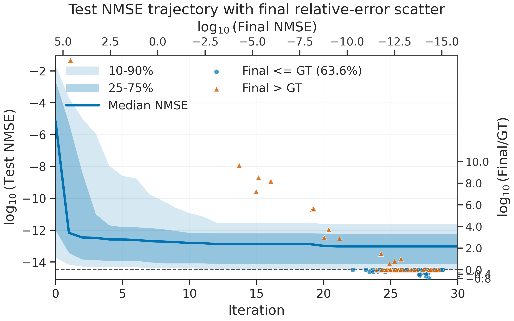
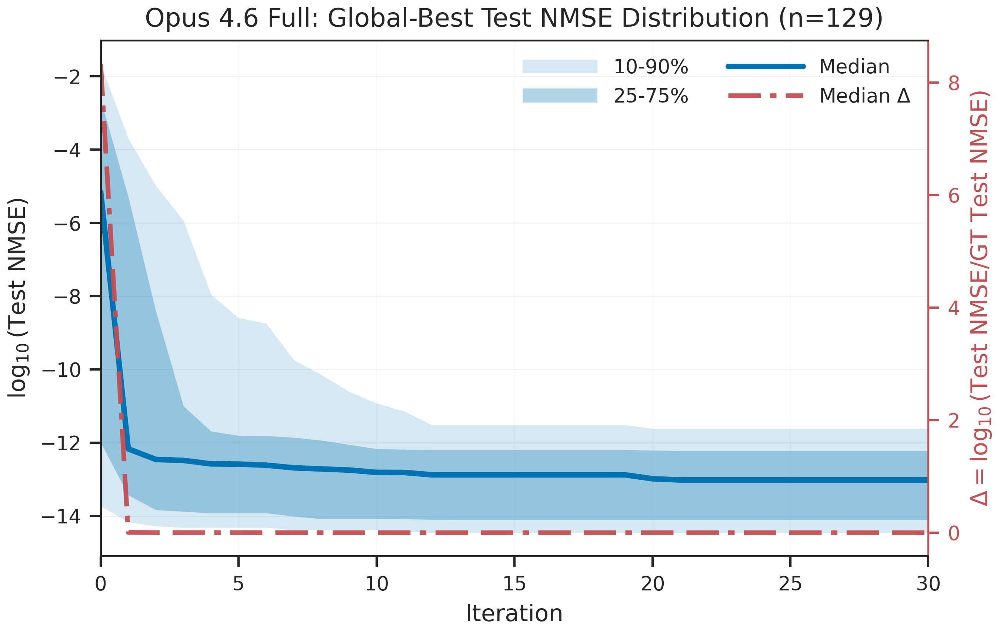
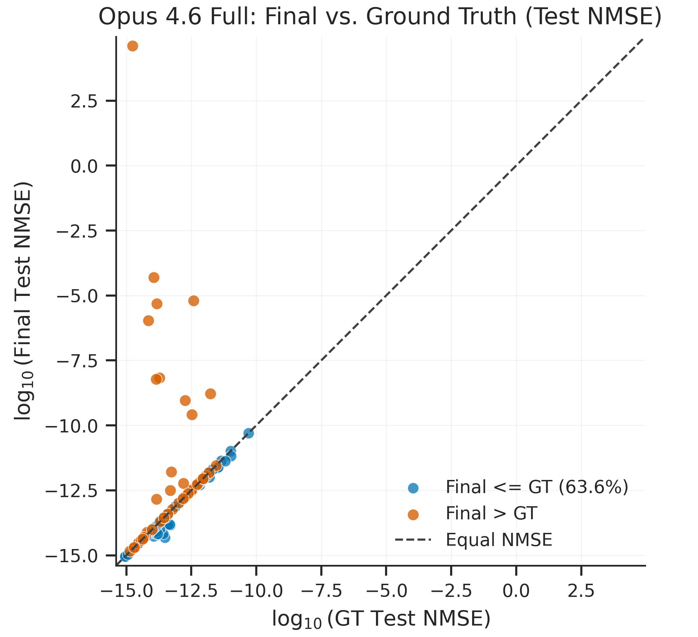
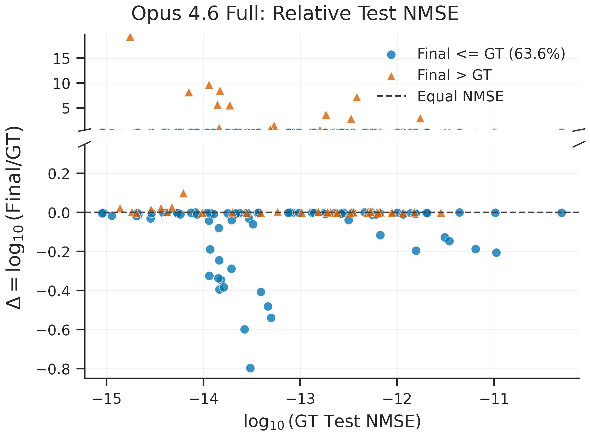
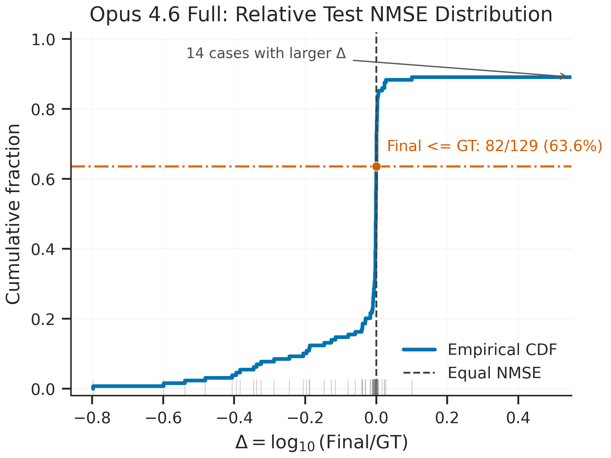
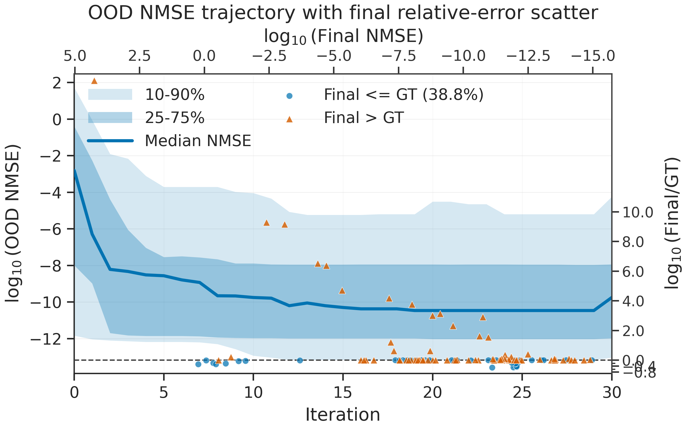
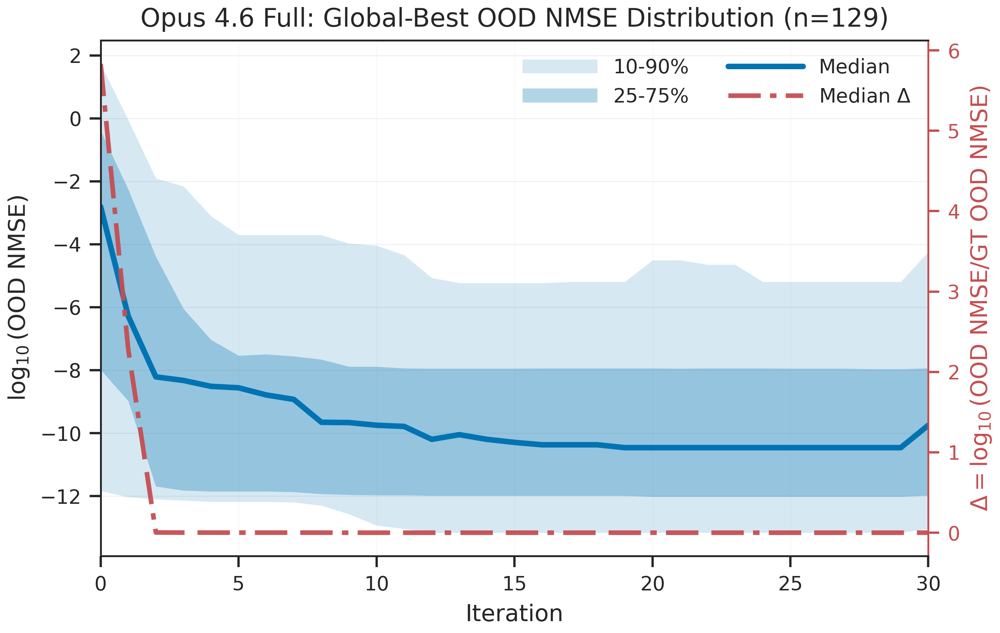
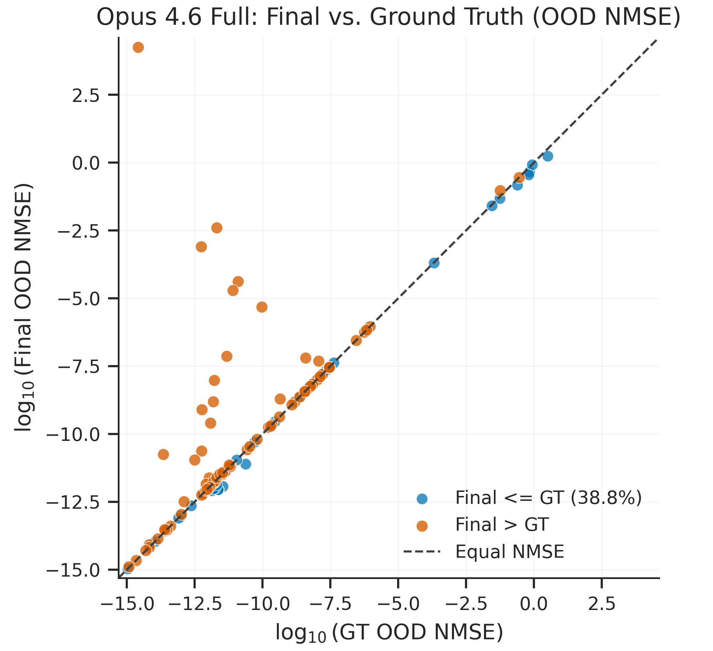
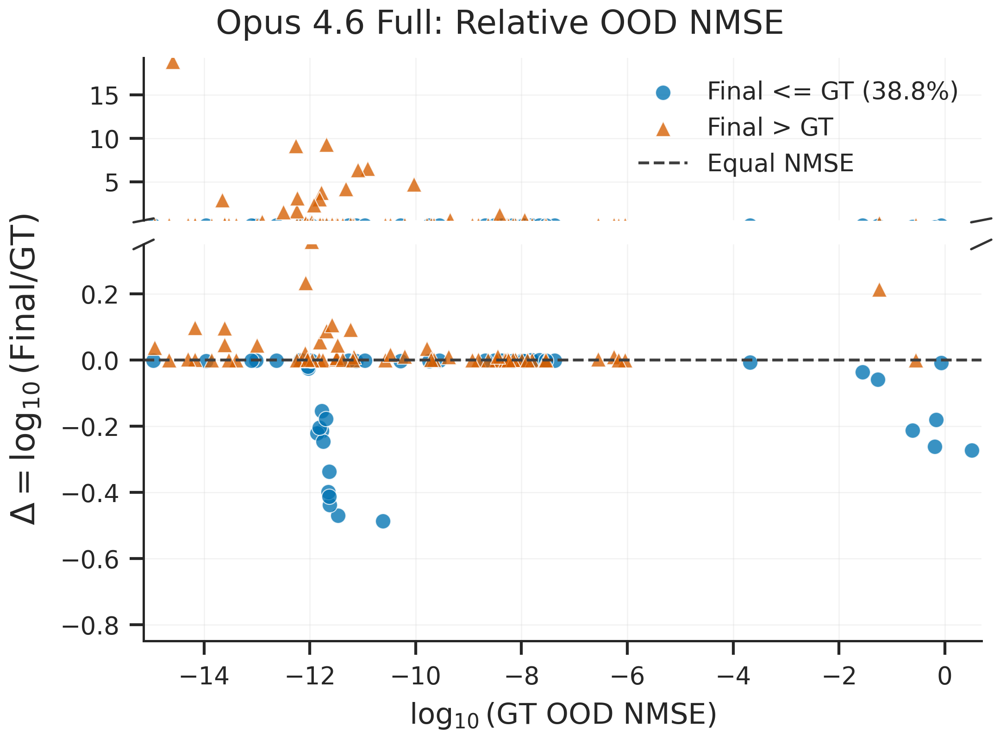
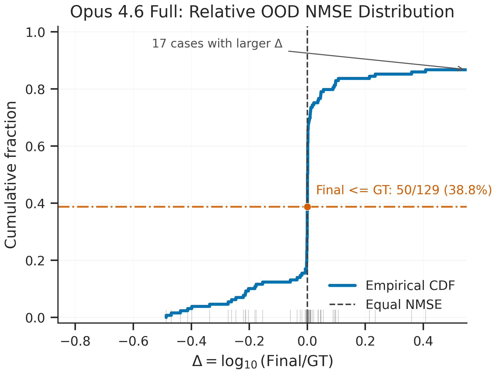

# Opus 4.6 Full NMSE Figures

This document explains the eight Opus 4.6 full-run NMSE figures in this directory. The figures are split into two evaluation settings:

- **Test NMSE**: performance on the in-distribution test split.
- **OOD NMSE**: performance on the out-of-distribution split.

Each setting has the same four views:

- **Log-quantile trajectory**: distribution of global-best NMSE over iterations.
- **Final-vs-GT scatter**: paired final NMSE against ground-truth NMSE.
- **Delta-vs-GT scatter**: relative final error, shown as log-ratio to ground truth.
- **Delta ECDF**: cumulative distribution of relative final error.

The paper uses an additional combined view for each setting:

- **Combined trajectory with final relative-error scatter**: the log-quantile trajectory overlaid with final per-task scatter using top/right axes.

The relative error used in the delta plots is

$$
\Delta_i=\log_{10}\left(\frac{\mathrm{Final}_i}{\mathrm{GT}_i}\right).
$$

Thus, $\Delta_i \le 0$ means the final result is no worse than the corresponding ground-truth expression on that case.

## Data And Semantics

All figures use the 129 non-aggregate cases for `opus-4-6/full` from `docs/metrics/selected_combined_nmse.csv`.

The ground-truth NMSE values are parsed from each selected source log line:

```text
[Ground Truth] train=...  test=...  ood=...
```

For final paired plots, the final NMSE is taken from `docs/metrics/selected_combined_nmse.csv`:

- `test_nmse` for Test NMSE figures.
- `ood_nmse` for OOD NMSE figures.

For trajectory plots:

- Test trajectories show the global-best test NMSE over iterations.
- OOD trajectories show the OOD NMSE of the global-best candidate at each iteration. In other words, OOD is not retrospectively minimized over iterations; it follows the candidate selected by the global-best optimization process.

## Summary

| Metric | Cases | Final <= GT | Win rate | Median Delta | Tail cases with Delta > 0.55 |
|---|---:|---:|---:|---:|---:|
| Test NMSE | 129 | 104 | 80.6% | -0.00243 | 8 |
| OOD NMSE | 129 | 67 | 51.9% | 0.00000 | 12 |

Interpretation:

- On Test NMSE, Opus 4.6 full beats or matches the ground-truth NMSE on most cases.
- On OOD NMSE, the result is close to balanced overall, with a small majority of cases at or below GT but more large positive-delta failures.
- The median delta alone should not be read as a win-rate summary, because many cases are tightly clustered around zero and a few large failures can dominate visual scale.

## Test NMSE Figures

### Test Combined Trajectory With Final Relative-Error Scatter



File:

- `docs/figures/opus46_full_test_nmse_combined.png`
- `docs/figures/opus46_full_test_nmse_combined.pdf`

What it shows:

- The bottom/left axes show the Test log-quantile trajectory.
- The overlaid points use the top/right axes: x is final $\log_{10}(\mathrm{Test\ NMSE})$, and y is $\Delta=\log_{10}(\mathrm{Final}/\mathrm{GT})$.
- Blue circles have $\Delta\le 0$; orange triangles have $\Delta>0$.

### 1. Test Log-Quantile Trajectory



File:

- `docs/figures/opus46_full_test_nmse_log_quantiles.png`
- `docs/figures/opus46_full_test_nmse_log_quantiles.pdf`
- `docs/figure_data/opus46_full_test_nmse_log_quantiles.csv`

What it shows:

- The blue median line is the per-iteration median of $\log_{10}(\mathrm{Test\ NMSE})$ across the 129 cases.
- The darker blue band is the 25-75% interval.
- The lighter blue band is the 10-90% interval.
- The red dash-dot-dash curve uses the right y-axis and shows the median $\Delta$ over iterations.

How to read it:

- This figure summarizes optimization stability and convergence across cases.
- The median line is a marginal median at each iteration; it is not a single real trajectory.
- The red delta curve compares the current global-best test NMSE to the per-case ground-truth test NMSE.

### 2. Test Final-vs-GT Scatter



File:

- `docs/figures/opus46_full_test_nmse_final_vs_gt.png`
- `docs/figures/opus46_full_test_nmse_final_vs_gt.pdf`
- `docs/figure_data/opus46_full_test_nmse_final_vs_gt.csv`

What it shows:

- Each point is one case.
- The x-axis is $\log_{10}(\mathrm{GT\ Test\ NMSE})$.
- The y-axis is $\log_{10}(\mathrm{Final\ Test\ NMSE})$.
- The dashed diagonal is equal NMSE.
- Blue points satisfy `Final <= GT`; orange points are worse than GT.

Key result:

- `Final <= GT` on 104/129 cases, or 80.6%.

How to read it:

- Points below the diagonal are better than GT.
- Points above the diagonal are worse than GT.
- This plot preserves the paired comparison, but a few large failures stretch the axis and compress the dense cluster.

### 3. Test Delta-vs-GT Scatter



File:

- `docs/figures/opus46_full_test_nmse_delta_vs_gt.png`
- `docs/figures/opus46_full_test_nmse_delta_vs_gt.pdf`
- `docs/figure_data/opus46_full_test_nmse_delta_values.csv`

What it shows:

- The x-axis is $\log_{10}(\mathrm{GT\ Test\ NMSE})$.
- The y-axis is $\Delta=\log_{10}(\mathrm{Final}/\mathrm{GT})$.
- The dashed horizontal line at $\Delta=0$ is equal NMSE.
- Blue points are no worse than GT; orange points are worse than GT.
- The y-axis is broken to show both the dense near-zero region and the large positive-delta failures.

How to read it:

- Negative delta means improvement over GT.
- Zero means equal to GT.
- Positive delta means worse than GT.
- Compared with the paired scatter, this figure emphasizes relative performance without forcing both axes to cover the same large range.

### 4. Test Delta ECDF



File:

- `docs/figures/opus46_full_test_nmse_delta_ecdf.png`
- `docs/figures/opus46_full_test_nmse_delta_ecdf.pdf`
- `docs/figure_data/opus46_full_test_nmse_delta_values.csv`

What it shows:

- The x-axis is $\Delta=\log_{10}(\mathrm{Final}/\mathrm{GT})$.
- The y-axis is the cumulative fraction of cases.
- The vertical dashed line marks $\Delta=0$.
- The horizontal orange line marks the fraction of cases with `Final <= GT`.
- Rug marks show individual case locations along the delta axis.

Key result:

- The ECDF crosses $\Delta=0$ at 104/129 = 80.6%.

How to read it:

- This is the cleanest win-rate view for Test NMSE.
- The main x-axis focuses near $\Delta=0$; the annotation indicates cases with larger positive delta outside the focused range.

## OOD NMSE Figures

### OOD Combined Trajectory With Final Relative-Error Scatter



File:

- `docs/figures/opus46_full_ood_nmse_combined.png`
- `docs/figures/opus46_full_ood_nmse_combined.pdf`

What it shows:

- The bottom/left axes show the OOD log-quantile trajectory.
- The overlaid points use the top/right axes: x is final $\log_{10}(\mathrm{OOD\ NMSE})$, and y is $\Delta=\log_{10}(\mathrm{Final}/\mathrm{GT})$.
- Blue circles have $\Delta\le 0$; orange triangles have $\Delta>0$.

### 5. OOD Log-Quantile Trajectory



File:

- `docs/figures/opus46_full_ood_nmse_log_quantiles.png`
- `docs/figures/opus46_full_ood_nmse_log_quantiles.pdf`
- `docs/figure_data/opus46_full_ood_nmse_log_quantiles.csv`

What it shows:

- The blue median line is the per-iteration median of $\log_{10}(\mathrm{OOD\ NMSE})$ across the 129 cases.
- The darker blue band is the 25-75% interval.
- The lighter blue band is the 10-90% interval.
- The red dash-dot-dash curve uses the right y-axis and shows the median OOD delta over iterations.

How to read it:

- This figure asks how the global-best candidate generalizes to OOD over iterations.
- It does not select the best OOD candidate after the fact; it evaluates the candidate selected by the global-best optimization process.

### 6. OOD Final-vs-GT Scatter



File:

- `docs/figures/opus46_full_ood_nmse_final_vs_gt.png`
- `docs/figures/opus46_full_ood_nmse_final_vs_gt.pdf`
- `docs/figure_data/opus46_full_ood_nmse_final_vs_gt.csv`

What it shows:

- Each point is one case.
- The x-axis is $\log_{10}(\mathrm{GT\ OOD\ NMSE})$.
- The y-axis is $\log_{10}(\mathrm{Final\ OOD\ NMSE})$.
- The dashed diagonal is equal NMSE.
- Blue points satisfy `Final <= GT`; orange points are worse than GT.

Key result:

- `Final <= GT` on 67/129 cases, or 51.9%.

How to read it:

- This paired view is useful for checking which cases improve or regress relative to GT on OOD.
- As with the test scatter, large failures can stretch the scale.

### 7. OOD Delta-vs-GT Scatter



File:

- `docs/figures/opus46_full_ood_nmse_delta_vs_gt.png`
- `docs/figures/opus46_full_ood_nmse_delta_vs_gt.pdf`
- `docs/figure_data/opus46_full_ood_nmse_delta_values.csv`

What it shows:

- The x-axis is $\log_{10}(\mathrm{GT\ OOD\ NMSE})$.
- The y-axis is $\Delta=\log_{10}(\mathrm{Final}/\mathrm{GT})$.
- The dashed horizontal line at $\Delta=0$ is equal NMSE.
- Blue points are no worse than GT; orange points are worse than GT.
- The y-axis is broken to keep both the dense near-zero region and large failures visible.

How to read it:

- This figure highlights that OOD performance is less uniformly better than GT than test performance.
- Positive outliers indicate cases where the final expression generalizes much worse than GT.

### 8. OOD Delta ECDF



File:

- `docs/figures/opus46_full_ood_nmse_delta_ecdf.png`
- `docs/figures/opus46_full_ood_nmse_delta_ecdf.pdf`
- `docs/figure_data/opus46_full_ood_nmse_delta_values.csv`

What it shows:

- The x-axis is $\Delta=\log_{10}(\mathrm{Final}/\mathrm{GT})$.
- The y-axis is the cumulative fraction of cases.
- The vertical dashed line marks $\Delta=0$.
- The horizontal orange line marks the fraction of cases with `Final <= GT`.
- Rug marks show individual case locations along the delta axis.

Key result:

- The ECDF crosses $\Delta=0$ at 67/129 = 51.9%.

How to read it:

- This is the cleanest win-rate view for OOD NMSE.
- Compared with Test NMSE, the OOD ECDF puts much less mass to the left of zero, indicating weaker OOD dominance over GT.

## Reproduction

The figures are generated by these scripts:

- `docs/plots/plot_opus46_full_quantiles.py`: creates `*_log_quantiles.{png,pdf,csv}` for both test and OOD.
- `docs/plots/plot_opus46_full_gt_scatter.py`: creates `*_final_vs_gt.{png,pdf,csv}` for both test and OOD.
- `docs/plots/plot_opus46_full_delta_views.py`: creates `*_delta_vs_gt.{png,pdf}`, `*_delta_ecdf.{png,pdf}`, and `*_delta_values.csv` for both test and OOD.
- `docs/plots/plot_opus46_full_combined_nmse.py`: creates `*_nmse_combined.{png,pdf}` for both test and OOD, and copies paper-ready PNGs to the repository-level `imgs/` directory.

Run from the repository root:

```bash
python docs/plots/plot_opus46_full_quantiles.py
python docs/plots/plot_opus46_full_gt_scatter.py
python docs/plots/plot_opus46_full_delta_views.py
python docs/plots/plot_opus46_full_combined_nmse.py
```
